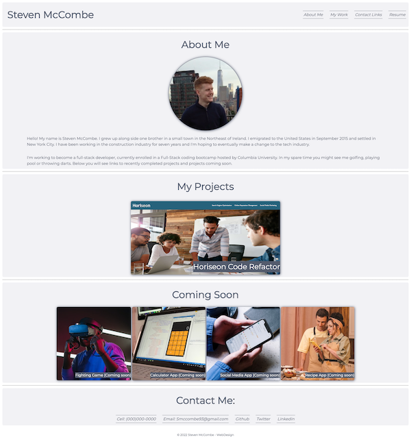
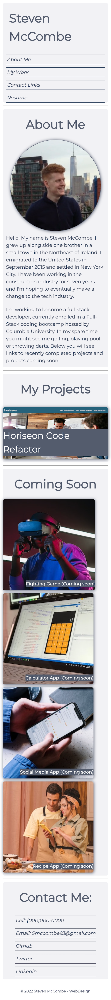

# StevenMcCombe-Portfolio

# Description

To showcase my web design skills for potential employers, I designed a portfolio webpage which includes a brief overview about me, upcoming and completed projects, and contact links. The webpage serves as both a responsive resume and advertisement of my skills. While building this webpage, I learned the importance of logical semantic structure and its benefits while styling, responsive design to capture all viewports across many devices, and how efficient variables are for code management.

## Link

[Deployed Webpage](https://steven-mccombe.github.io/StevenMcCombe-Portfolio/)

## Screenshot

## Credits

- CSS Reset Stylesheet - Courtesy of _[Columbia Coding Bootcamp.](https://bootcamp.cvn.columbia.edu/coding/)_
- Coming Soon images - Courtesy of _[Pexels.](https://www.pexels.com)_
- Font- Courtesy of - _[Google Fonts](https://fonts.googleapis.com/css?family=Montserrat)_

## License

MIT License
